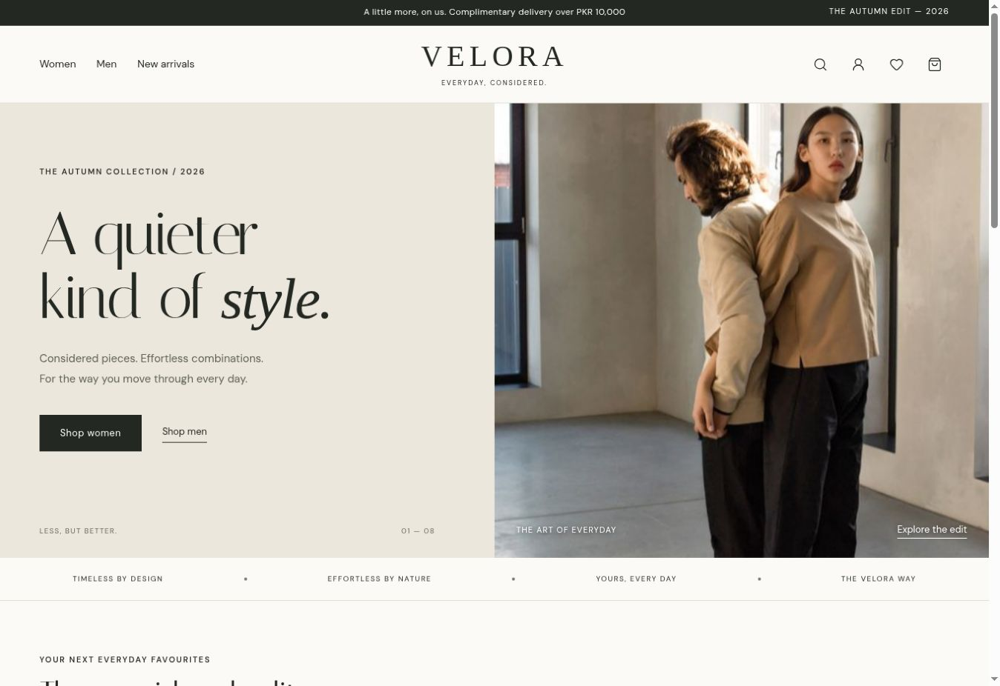

# VELORA — React Fashion Store

A complete **frontend demo** of a premium fashion shopping experience, built for Muhammad Abdullah's full-stack learning portfolio. Backend integration is intentionally reserved for a later phase.



## Open the interactive design without hosting

Double-click `preview/velora-preview.html` and open it in Chrome, Edge, Firefox or Safari. All JavaScript, CSS and product photos are embedded. No development server, database or live website is required. This offline file uses system fonts and hash routes so navigation works from disk. Browser-local storage may be restricted for local files; the shopping flow still works for the current session.

The standalone `velora-preview.html` download is the same file. An in-app file viewer may disable JavaScript; download it and open the actual HTML file in a browser.

## Run locally

Install **Node.js 22.13+** (Node 24 LTS is suitable), then open this folder in VS Code:

```bash
npm install
npm run dev
```

Open the local URL printed in your terminal. The project is plain **JavaScript + JSX**, not TypeScript.

```bash
npm run build     # create production files in dist/
npm run preview   # preview that production build
```

After the first install, use `npm ci` for a clean installation from the included lockfile.

## What works

- Editorial homepage with dedicated `/men`, `/women` and `/new-arrivals` pages.
- Search icon opens a live-search dialog with product results and a results-page action.
- Product search, category/collection filters and price/name sorting.
- Product details, size selection, illustrative size guide and colour selection for the bag.
- Wishlist and shopping bag saved in this browser's `localStorage`.
- Quantity controls (1–10 per variant), item removal and delivery calculations.
- Login/registration **UI previews**, Continue with Google demo flow, password visibility, confirmation validation and preview sign-out.
- Demo checkout with required-field, email, phone and postcode validation.
- Loading, empty, error and local order-confirmation states.
- Responsive layouts, keyboard focus styles, accessible labels and reduced-motion support.

## What is deliberately not connected

No database, real authentication, password storage, payment gateway, email delivery, inventory API or real orders. All products, prices, fabric details and delivery rules are illustrative. Passwords, email addresses and checkout contact data are **not stored or submitted**. Only the account preview's display name is kept in `sessionStorage`.

An order confirmation exists only in React state; reloading it clears the confirmation. Cart and wishlist are browser-local, not synced between devices. Google Fonts needs an internet connection; local system fallbacks are provided. Product photographs are bundled locally.

## Where to start reading

| File                                     | Purpose                                        |
| ---------------------------------------- | ---------------------------------------------- |
| `src/main.jsx`                           | Mounts React into the HTML page                |
| `src/App.jsx`                            | Defines routes and page metadata               |
| `src/pages/Home.jsx`                     | Homepage layout using reusable cards           |
| `src/lib/store/products.js`              | Product array, variants and price helpers      |
| `src/components/store/StoreProvider.jsx` | Shared state and shopping actions              |
| `src/components/store/ProductCard.jsx`   | A reusable product card receiving props        |
| `src/components/store/Catalog.jsx`       | Search, filter, sort and list rendering        |
| `src/components/store/ProductDetail.jsx` | Selected product, size and colour logic        |
| `src/components/store/StoreShell.jsx`    | Header, footer and accessible bag dialog       |
| `src/components/store/AuthForm.jsx`      | Frontend account forms                         |
| `src/components/store/Checkout.jsx`      | Checkout validation and simulated confirmation |
| `src/styles.css`                         | Theme, layout, responsive rules and animations |

Read `docs/LEARNING-GUIDE.md` for a beginner-friendly explanation of how JSX and JavaScript work together.

## Deploying the standalone version

Upload the contents of `dist/` to a static host that supports SPA fallback. All application routes must fall back to `index.html`; the included `public/_redirects` supports hosts that recognize this format. Other hosts need their equivalent rewrite setting. This build assumes hosting at the domain root, not a GitHub Pages repository subpath.

## Validation

The shared storefront was checked in a browser for search, sorting, wishlist updates, size validation, cart quantity changes, persistence after refresh, colour selection, checkout confirmation, registration mismatch validation, account preview and sign-out. The standalone React/Vite distribution also passes its production build.

The updated production bundle passes 18 automated interaction checks in a local DOM. The single-file preview also passes navigation, product, search and demo account checks under a file URL. Native browser access was blocked during this revision, so visual/focus behaviour of the updated dialogs has not been rechecked in a real browser. A full device/browser compatibility matrix has not been run.

## Rebuild and check

```bash
npm test                 # build + production-bundle interaction checks
npm run build:offline    # regenerate the standalone interactive HTML file
node tests/offline-preview.mjs
```

These checks use a simulated DOM. Native dialog focus, layout, animations and actual device behaviour still need browser review.

## Next backend phase

Replace the product array with an API, add real authentication, store carts/orders server-side, and integrate a payment provider with server-side verification. Treat all frontend totals and state as untrusted when a backend is introduced.

## Credits

Photography sources and reuse information are in `IMAGE-CREDITS.md`. The catalog is fictional; models and photographers do not endorse VELORA. Interface icons: Lucide. Fonts: DM Sans and Italiana through Google Fonts.
